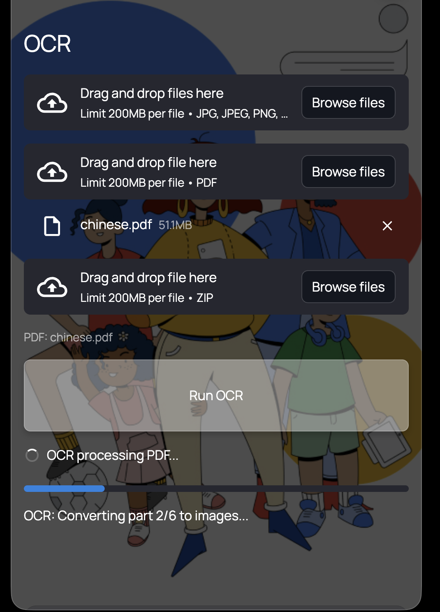
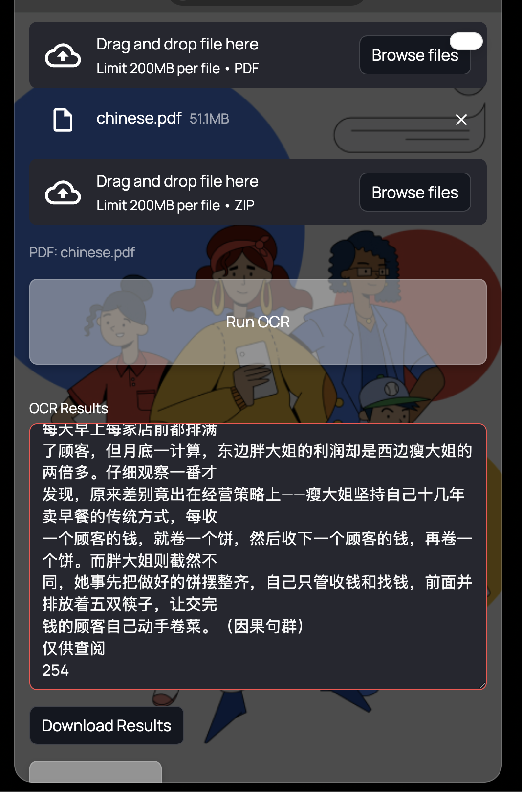

# Chinese Learning Materials – User Guide

This guide explains how to use the Chinese learning materials website provided in this project.

- Website: [Language textbook assitant](https://longee.streamlit.app/)

- The background image is from: [Teddy Ninh](https://www.teddyninh.com/projects/google-illustrations)

---

## 1. Open the Website

If you are using the web version, it’s recommended to shrink the interface for better viewing. For example, on a Mac desktop:


---

## 2. Browse Directories

After opening the website:

1. Choose a specific directory you want to study.
2. Click to enter the directory content.

Example screenshot:


---

## 3. Wait for Recommendations

Please wait a moment. The model will generate learning material recommendations based on the specified links & key words that I wrote on script and the current page theme.  

For example, if the current theme is **Make small talk**, the recommended links may include:


- **Youtube**  
    
  

- **Quizlet**  
  

- **Chinese StackExchange**  
  

---

## 4. Usage Tips

The model already knows the theme and content of the current page (set via the script).  
You can directly ask questions about this content without providing additional background information.

---
## 5. Teaching Principles & Feedback

The AI follows predefined teaching principles to guide its responses. Instead of giving direct answers, it helps you discover them step by step.

See [teaching_principle.txt](teaching_principle.txt) for details.

All interactions (your answers and AI responses) are saved in [feedback.md](feedback.md) for review.
---

## 6. OCR

This module extracts text from images and non-searchable documents for further interaction with AI.

### Availability
- **Local only (for now)**  
- The OCR service runs on a China-based server, while the online app ([Streamlit](chatgpt://generic-entity?number=0) Cloud) is hosted in the US.  
- Due to cross-region restrictions, OCR cannot be used in the online version.

> Future plan: explore making this feature available online.

---

### Supported Inputs

#### 1. Image
- Upload a single image  
- Extracted text is sent directly to the chat  
- Enables immediate interaction with the model  

#### 2. ZIP (Batch Images)
- For bulk processing (recommended)  
- Upload up to ~300 images per batch  

**Suggested workflow:**
1. Put images into a folder  
2. Compress into `.zip`  
3. Upload for processing  

- Output: a single processed text file  

#### 3. PDF
- Designed for **non-searchable PDFs** (e.g., scanned textbooks, old books)  
- Converts scanned content into readable text  

**Limits & Processing:**
- Max **50 pages per run**  
- For large PDFs (e.g., 1000 pages):  
  - Split into multiple parts (e.g., 20 × 50 pages)  
  - Process each part separately  

- Parallel processing is enabled → large files can still be processed quickly (often within minutes)

- Output: a single processed text file per batch  

---

### Notes
- Batch processing may be rate-limited (~300 images/hour)  
- ZIP and PDF outputs are saved as files for later use  
- Image mode is best for quick interaction with AI models  

---

### Images
  
  
  

 

---

# Chinese Learning Dataset

> A very small personal dataset built purely for learning programming and natural language processing (NLP). Nothing serious here.

🌐 Companion website: [chineselearning-longe.streamlit.app](https://longee.streamlit.app/)

---

## About

This dataset is sourced from Chinese text content. At the moment it only provides a **high-level outline skeleton** (chapter structure) — the actual content will be expanded and filled in gradually over time.

**Primary purpose:** Learning NLP techniques. That's it.

If it happens to be useful for anyone learning Chinese, great — but this is not intended as a Chinese learning resource.

---

## Current Status / TODO

### Data Cleaning
- [ ] Clean existing Chinese dataset
- [ ] Expand outline skeleton into full content
- [ ] Structure data into JSON format

### Model
Currently using supported models by Groq. It has limitations and isn't great for complex tasks, but it works fine as an experiment. Planning to find cheaper or free multimodal AI alternatives down the line. Groq has rate limits that make using agents very difficult.

---

## Roadmap: Agent Crew

Planning to build a crew of **5 agents** to handle the dataset pipeline — essentially object-oriented programming, with each agent defined as a class with its own methods and responsibilities.

### Agent Architecture

| Agent | Role | Model Complexity |
|-------|------|-----------------|
| **Agent 1 — Supervisor** | Monitors all agents, reports progress | Complex |
| **Agent 2 — Design** | Handles UI and visual design tasks | Simple |
| **Agent 3 — Deployment** | Manages GitHub / Streamlit publishing | Simple |
| **Agent 4 — Data Processing** | Scrapes and cleans Chinese text from PDFs, web pages, and raw text files; outputs structured JSON | Complex |
| **Agent 5 — Script Editor** | Takes cleaned data and refines/updates scripts accordingly | Complex |

### Workflow

```
Supervisor Agent (1)
    ├── Data Processing Agent (4) → clean text / PDF / web → JSON
    │       └── Script Editor Agent (5) → update scripts
    ├── Design Agent (2) → UI design
    └── Deployment Agent (3) → GitHub + Streamlit publish
```

---

## Stack

- **Language model:** Production Models supported by Groq
- **Web app:** Streamlit
- **Data format:** JSON
- **Deployment:** GitHub + Streamlit Cloud


- Current Status: Skeleton only; detailed content isn’t needed yet because an app will provide AI-assisted support.

- AI Support: The AI will use the outline and examples for systematic learning, guided by principles and workflow I’ll provide.

- Future Plans: Add code, upload videos, images, and more detailed materials.

- Purpose: Just started, mainly for my coding practice; not sure if it would be useful for your Chinese learning.

---
Teaching Principles

Here’s what I’m thinking: for example, why AI learning languages has limitations. AI lacks teaching principles. When a teacher teaches, the first goal is to help the student understand, not just deliver knowledge. AI may know language learning theory and provide resources, but it doesn’t provide teaching itself. Teaching has its own principles. I’ve studied a lot of language teaching theory —for instance, when learning a language, full immersion is the first step, which would require giving AI very specific teaching instructions. AI usually cannot judge a learner’s level and can’t use gestures or face-to-face interaction to aid understanding, but it can use images or videos. The problem is, if AI searches for resources on its own, it won’t match the learner’s level, and the results may not be appropriate.

LLM Limitations

Large language models, like Claude or ChatGPT, have context limits. Feeding in an entire book is cumbersome. You need to compress the materials into an outline and match resources according to it, which avoids context limitations. Otherwise, every query is tedious. Large models have a lot of knowledge but don’t understand teaching principles or methods—they lack “common sense” for instruction.

Solution

I plan to prepare dedicated video and image databases as backup resources for AI. I’ll also build databases for vocabulary, sentences, pronunciation, and grammar, all graded (beginner, intermediate, advanced). Images and videos will be graded as well. The different databases can be interlinked. Using Python or JSON, I’ll create key-value mappings so AI can retrieve relevant resources based on the outline without needing all content directly. Videos, images, vocabulary, grammar, sentences, and texts will all be connected to the outline, forming a large network for easy AI reference.

I plan to use agent-based division to handle these tasks. I’m still exploring and learning—treating it as practice haha.

---
教学常识

我现在的想法是这样的：比如说，为什么用人工智能学习语言会有局限？因为AI缺少教学理念。老师教学生时，首先要帮助学生理解，而不仅仅是传递知识。AI虽然有语言学习理论，但它提供的是资源，不是教学本身。教学有自己的原则。我以前在看过很多语言教学理论，比如学习一门语言时，第一步是完全沉浸在语言环境中，这就需要给AI特别的教学指令。AI通常分不清学习者的水平，也无法用肢体语言或面对面交流帮助理解，但可以用图片或视频辅助。问题是，如果让AI自己搜索资源，它不会根据学习者水平筛选，结果可能不匹配。

LLM的问题

大型语言模型（比如Claude或ChatGPT）有上下文限制，如果把整本书喂进去非常麻烦。必须把资料压缩成outline，然后根据outline匹配资源，这样就能绕过上下文限制。否则每次查询都很麻烦。大模型知识丰富，但并不懂教学原则和方法，没有“常识”。

解决方案

我打算准备专门的视频和图片数据库，作为AI查找资料的备用资源。同时建立词汇、句子、发音、语法等数据库，并分级（初级、中级、高级）。图片和视频也分级，不同数据库之间可以互相关联。通过Python或JSON建立键值匹配，AI只需根据outline就能查到相关资源，而不需要输入全部内容。视频、图片、词汇、语法、句子、文本等都和outline串联，形成大网络，便于AI查找。

我打算用agent分工来做这些事情，目前还在摸索和学习，把它当作练习哈哈哈。

---

# Groq Models Analysis for Lightweight PDF Interaction

**Goal:** Convert static PDFs into searchable, explainable, lightly interactive content.  
**Not** intended for deep reasoning or complex tasks (for those, stronger paid models such as ChatGPT or Claude should be used).

This analysis focuses on **speed, multimodality, accuracy, hallucination risk, reasoning quality, and retrieval performance.**

---

## 1. Llama 4 Scout 17B  
**Model ID:** `meta-llama/llama-4-scout-17b-16e-instruct`  
**Docs:** https://console.groq.com/docs/model/llama-4-scout-17b-16e-instruct?utm_source=chatgpt.com

### Capabilities
- Text and **image understanding** (multimodal)  
- Long context (128K tokens)  
- Tool use, JSON schema modes, structured output  
- High inference speed (~750 tps on Groq)  [oai_citation:0‡GroqCloud](https://console.groq.com/docs/model/llama-4-scout-17b-16e-instruct?utm_source=chatgpt.com)

### Strengths
- **Multimodal support:** can reference images/diagrams inside PDFs  
- **Fast & efficient:** Mixture‑of‑experts (MoE) architecture balance speed and capability  
- **Accurate summarization:** lower hallucination relative to smaller models  
- Long context helps larger documents without chunking

### Weaknesses
- Reasoning depth below that of very large models  
- May still hallucinate if prompt is poorly structured  
- No built‑in real‑time browsing

### When to use
- **Image‑rich PDFs**
- Diagram explanation
- Fast retrieval with context
- Simple summarization tasks

---

## 2. Llama 3.3 70B

### Capabilities
- Large dense model with strong reasoning  
- Reasoning and explanation at a higher level

### Strengths
- **High reasoning quality:** better understanding of complex content  
- Excellent for concept explanation  
- Long context support

### Weaknesses
- Slower inference (~280 tps) compared to mid‑sized models  [oai_citation:1‡GroqCloud](https://console.groq.com/docs/models?source=post_page-----09e2d46f3ce7--------------------------------&utm_source=chatgpt.com)  
- Not multimodal out of the box  
- Higher resource demand

### When to use
- **Deep semantic explanation**
- Complex relationships within PDF text
- Data interpretation

---

## 3. Llama 3.1 8B

### Capabilities
- Lightweight text generation model  
- Fast (~560 tps on Groq)  [oai_citation:2‡GroqCloud](https://console.groq.com/docs/models?source=post_page-----09e2d46f3ce7--------------------------------&utm_source=chatgpt.com)

### Strengths
- **Fastest simple model**
- Low hallucination risk due to simpler use cases

### Weaknesses
- Weak reasoning or nuanced explanatory quality  
- Not recommended for detailed answer generation

### When to use
- **Search suggestions**
- Fast keyword extraction
- Frontline model in tiered routing

---

## 4. GPT OSS 120B

### Capabilities
- Very large MoE model with strong reasoning  
- Built‑in tool use (web search, code execution, browsing) when paired with Compound systems  [oai_citation:3‡GroqCloud](https://console.groq.com/docs/compound/systems/compound-beta?utm_source=chatgpt.com)

### Strengths
- Highest reasoning quality among Groq models  
- Good for workflows requiring external data  
- Strong performance even beyond PDF text

### Weaknesses
- Slower than 20B and Scout
- Higher hallucination risk if unvalidated
- Overkill for lightweight PDF tasks

### When to use
- **Fallback for unanswered queries**
- When user explicitly asks for explanation beyond PDF content

---

## 5. GPT OSS 20B

### Capabilities
- Mid‑sized MoE  
- High throughput (~1000 tps class relative to other models)

### Strengths
- **Best balance of speed and quality**
- Good at structured instruction following  
- Often performs well in instruction tasks without hallucinating excessively  [oai_citation:4‡Reddit](https://www.reddit.com/r/LocalLLaMA/comments/1mypokb?utm_source=chatgpt.com)

### Weaknesses
- Not as deep reasoning as 70B or 120B  
- Hallucination possible in edge cases

### When to use
- **Main QA model**
- Primary explanation generation from PDF
- Retention of structure in answers

---

## 6. Qwen 3 32B

### Capabilities
- Large multilingual model  
- Strong across languages such as Chinese

### Strengths
- **Better multilingual text handling**
- Good comprehension and generation quality

### Weaknesses
- Slower than 20B on Groq  [oai_citation:5‡GroqCloud](https://console.groq.com/docs/models?source=post_page-----09e2d46f3ce7--------------------------------&utm_source=chatgpt.com)
- Not as strong tool integration as Compound

### When to use
- **Language learning PDFs**
- Non‑English text comprehension

---

## 7. Kimi K2 Instruct

### Capabilities
- Extremely long context (up to 256K tokens)  
- Agentic reasoning and document understanding

### Strengths
- **Best for large PDF corpora**
- State‑of‑the‑art agentic reasoning among open models  [oai_citation:6‡Reddit](https://www.reddit.com/r/LocalLLaMA/comments/1lx8xdm?utm_source=chatgpt.com)

### Weaknesses
- Slower inference
- Cost and complexity higher
- Overkill for simple tasks

### When to use
- **Very large PDFs**
- Cross‑section reasoning across chapters

---

## 8. Groq Compound

### Capabilities
- Tool‑enabled system using web search, code execution, browse, Wolfram, etc  [oai_citation:7‡GroqCloud](https://console.groq.com/docs/compound/systems/compound-beta?utm_source=chatgpt.com)  
- Uses multiple underlying models intelligently

### Strengths
- **External web search + up‑to‑date content**
- Can answer questions outside PDF scope
- Powerful when combined with real‑world data

### Weaknesses
- **Not guaranteed accurate for all PDF tasks**
- Requires careful prompt validation

### When to use
- **Non‑PDF queries**
- Real‑time data or outside research

---

## 9. Groq Compound Mini

### Capabilities
- Limited agent tool usage  
- Lower latency than full Compound  [oai_citation:8‡GroqCloud](https://console.groq.com/docs/models?source=post_page-----09e2d46f3ce7--------------------------------&utm_source=chatgpt.com)

### Strengths
- Good for simple external lookup

### Weaknesses
- Less powerful than full Compound

### When to use
- **Light external info lookup**

---

# Cross‑Model Quality & Hallucination Considerations

For PDF usage, hallucination (fabricated or incorrect responses) is a major risk.

- **Lower risk models:**  
  - GPT OSS 20B tends to follow instructions well with less circular reasoning  [oai_citation:9‡Reddit](https://www.reddit.com/r/LocalLLaMA/comments/1mypokb?utm_source=chatgpt.com)  
  - Hierarchical routing (8B → 20B → 70B) reduces hallucination

- **Higher risk if unvalidated:**  
  - Very large models like GPT OSS 120B can hallucinate when outside their training domain  
  - Tool usage may produce plausible but incorrect web snippets

- **Accuracy boosters:**  
  - System prompts and answer validation layers
  - Redundancy checks (cross‑verify with embedding retrieval)

---

# Speed and Context Comparison

| Model                | Approx Speed | Context Window | Multimodal | Best For |
|---------------------|--------------|----------------|------------|----------|
| GPT OSS 20B         | Very fast    | 131K           | No         | Main QA |
| Llama 3.1 8B        | Fast         | 131K           | No         | Search |
| Llama 4 Scout 17B   | Fast         | 131K           | Yes        | Image + PDF |
| Qwen 3 32B          | Moderate     | 131K           | No         | Multilingual |
| Llama 3.3 70B       | Slower       | 131K           | No         | Deep reasoning |
| GPT OSS 120B        | Moderate     | 131K           | No         | Fallback reasoning |
| Kimi K2 Instruct    | Slowest      | 262K           | No         | Large docs |
| Groq Compound       | Moderate     | 131K           | No         | Web + PDF |
| Compound Mini       | Moderate     | 131K           | No         | Lightweight lookup | 

---

# Practical Model Recommendations

**For your lightweight PDF system:**

### 1. Fast search and simple answers
- **Use:** Llama 3.1 8B  
- **Why:** fastest response, low hallucination

### 2. Everyday PDF QA and RAG
- **Use:** GPT OSS 20B  
- **Why:** best balance of speed, instruction following, and quality

### 3. PDFs with Images / Diagrams
- **Use:** Llama 4 Scout 17B  
- **Why:** multimodal input support

### 4. Multilingual or learning books
- **Use:** Qwen 3 32B  
- **Why:** strong comprehension in multiple languages

### 5. Very large documents
- **Use:** Kimi K2 Instruct  
- **Why:** very long context support

### 6. Fallback for unanswered or external queries
- **Use:** Groq Compound Mini → then Compound  
- **Why:** web search, external tools

### 7. Complex deep reasoning beyond PDF
- **Use:** GPT OSS 120B  
- **Why:** richest reasoning model

---

## Conclusion

Your system should **prioritize speed, multimodal understanding, and instruction accuracy** for PDF tasks, with a **tiered fallback** architecture to avoid hallucination and maximize the relevance of answers.

This approach ensures:
- **fast responses**
- **lower hallucination**
- **better handling of images and language**
- **scalable routing for edge cases beyond simple PDF content**



---

# 📘 Full Model Capabilities Reference

The models available on GroqCloud include:

Model	Context Window	Speed (tokens/sec)	Capabilities
Llama 3.1 8B (llama-3.1-8b-instant)	131,072	~560	Fast text generation, retrieval
Llama 3.3 70B (llama-3.3-70b-versatile)	131,072	~280	Large reasoning, balanced
GPT OSS 20B (openai/gpt-oss-20b)	131,072	~1000	Fast QA, structured output
GPT OSS 120B (openai/gpt-oss-120b)	131,072	~500	Strong reasoning
Qwen 3 32B (qwen/qwen3-32b)	131,072	moderate	Multilingual reasoning
Llama 4 Scout 17B (meta-llama/llama-4-scout-17b-16e-instruct)	131,072	moderate	Vision + text (multimodal)
Kimi K2 Instruct (moonshotai/kimi-k2-instruct-0905)	262,144	slower	Very long context, deep document reasoning
Groq Compound Mini (groq/compound-mini)	131,072	~450	Web search, code exec, browsing
Groq Compound (groq/compound)	131,072	~450	Same tools but full agent abilities

These models vary in inference speed, reasoning quality, multimodal capability, and tool integration, all of which determine how you should use them.

---

# 📌 Case 1 — Language Learning (Chinese / English Textbooks)

🧠 Common Tasks
	•	Search vocabulary and definitions
	•	Provide example sentences
	•	Explain grammar patterns in context
	•	Interpret annotated images or tables from textbooks

📊 Model Roles and Why

Llama 3.1 8B — Fast Search & Retrieval
	•	Extremely fast retrieval of keywords and simple answers
	•	Good for table lookups and quick index queries
	•	Weakness: not deep in explanation

GPT OSS 20B — Primary Explanation Engine
	•	Fast and accurate for definitions and contextual examples
	•	Best balance of speed and explanatory quality
	•	Handles structured output well

Llama 4 Scout 17B — Multimodal Context
	•	Useful when PDFs contain images, diagrams, or grammar charts
	•	Provides interpretation of visual content plus text understanding

Qwen 3 32B — Multilingual Nuance
	•	Strong handling of bilingual content
	•	Especially useful for language learning beyond basic sentences

Llama 3.3 70B / GPT OSS 120B — Deep Semantics
	•	Use for complex questions like “compare usage across contexts”
	•	Better logical reasoning
	•	Slower and heavier

Compound Mini / Compound — Outside Knowledge
	•	If answer requires real‑world data beyond the PDF (e.g., current events, external dictionaries), use these with web search

Kimi K2 Instruct — Very Long PDFs
	•	If the language textbook is extremely large, shines with long‑context handling

🛠 Step‑by‑Step Workflow
	1.	Initial search → Llama 3.1 8B
	2.	Basic English/Chinese explanation → GPT OSS 20B
	3.	Multimodal explanation (images) → Llama 4 Scout 17B
	4.	Deep analysis or sentence nuance → Qwen 3 32B
	5.	Complex cases (rare) → Llama 3.3 70B or GPT OSS 120B
	6.	External lookup required → Groq Compound Mini / Compound
	7.	All models fail or high‑accuracy needed → fallback to ChatGPT or Claude

---

# 📘 Case 2 — Code Learning (Programming Books)

🧠 Common Tasks
	•	Locate code examples
	•	Explain snippets
	•	Debug explanation
	•	Provide interactive or web examples

📊 Model Roles and Why

Llama 3.1 8B — Quick Code Extraction
	•	Fast retrieval of code blocks
	•	Not reliable for detailed reasoning

GPT OSS 20B — Core Code Reasoner
	•	Good at explaining code
	•	Handles structured output (e.g., JSON mode)
	•	Best for instructional code examples

Groq Compound Mini / Compound — Code Tools
	•	Built‑in code execution or search can help verify code outputs
	•	Very useful for debugging or verifying code behavior in context

Qwen 3 32B — Multilingual Code Comments
	•	If code has comments or documentation in different languages
	•	Stronger at understanding mixed content

Llama 3.3 70B & GPT OSS 120B — Deep Debugging
	•	Analytical reasoning for complex debugging
	•	Use when GPT OSS 20B cannot explain a logic error

Kimi K2 — Large Projects
	•	If the book contains an entire project spread across chapters

🛠 Workflow
	1.	Search example → Llama 3.1 8B
	2.	Explain code snippet → GPT OSS 20B
	3.	Verify outputs and debugging → Groq Compound Mini or Compound (web search/code execution)
	4.	Conceptual deep dive → Qwen 3 32B
	5.	Complex logic or multi‑chapter reasoning → Llama 3.3 70B / GPT OSS 120B
	6.	Beyond all models → ChatGPT / Claude

---

# 📐 Case 3 — Math & Physics Textbooks

🧠 Common Tasks
	•	Search formula definitions
	•	Explain derivations
	•	Interpret graphs or diagrams
	•	Provide step‑by‑step reasoning

📊 Model Roles and Why

Llama 3.1 8B — Fast Formula Lookup
	•	Quick retrieval, baseline search

GPT OSS 20B — Math Explanation
	•	Good at structured explanation of formulas and steps
	•	Handles contextual queries well

Qwen 3 32B — Step‑by‑Step Reasoning
	•	Better at logic and multi‑step derivations
	•	Useful for step explanations in physics or calculus

Llama 4 Scout 17B — Diagrams
	•	Excellent at interpreting graphs/images inside textbooks

Llama 3.3 70B & GPT OSS 120B — Deep Reasoning
	•	Best for challenging derivations and proofs
	•	Slower but more capable

Kimi K2 Instruct — Huge Content
	•	Use only if PDF is extremely large and context‑heavy

Compound Mini / Compound — External Reference
	•	If you need real‑time formula definitions or external references beyond the book

🛠 Workflow
	1.	Search formula → Llama 3.1 8B
	2.	Basic explanation / steps → GPT OSS 20B
	3.	Image/graph interpretation → Llama 4 Scout 17B
	4.	Multi‑step derivation → Qwen 3 32B
	5.	Challenge problem / deep proof → Llama 3.3 70B / GPT OSS 120B
	6.	External lookup → Groq Compound Mini / Compound
	7.	Fallback for rigor → ChatGPT / Claude

---

🧠 General Model Strengths & Weaknesses

Llama 3.1 8B
	•	Strengths: fastest retrieval, low hallucination
	•	Weaknesses: shallow explanation

GPT OSS 20B
	•	Strengths: best overall balance of speed and quality
	•	Weaknesses: weaker than giant models for deep logic

Llama 3.3 70B
	•	Strengths: strong reasoning
	•	Weaknesses: slower

GPT OSS 120B
	•	Strengths: very strong reasoning
	•	Weaknesses: slowest in practice, potentially more expensive

Qwen 3 32B
	•	Strengths: multilingual, logical reasoning
	•	Weaknesses: moderate speed

Llama 4 Scout 17B
	•	Strengths: vision + text multimodal
	•	Weaknesses: not as strong at deep reasoning

Kimi K2 Instruct
	•	Strengths: huge context window for long docs
	•	Weaknesses: slower

Groq Compound Mini / Compound
	•	Strengths: external tool use (web search, code execution)
	•	Weaknesses: extra latency, not always in‑PDF

---

# 🚩 When to Fallback to ChatGPT / Claude

Even with all Groq models, you should only use paid proprietary models if:
	1.	No model can confidently answer the question from the PDF context
	2.	The model’s answer is inconsistent or hallucinatory
	3.	The question requires advanced, nuanced reasoning (e.g., original proofs, complex code analysis)
	4.	External real‑time knowledge is required and not easily available

---

Summary

The routing order for most queries:
	1.	Llama 3.1 8B → fast search
	2.	GPT OSS 20B → primary QA / explanation
	3.	Llama 4 Scout 17B → multimodal / images
	4.	Qwen 3 32B → deeper logic and multilingual
	5.	Llama 3.3 70B / GPT OSS 120B → complex reasoning
	6.	Groq Compound Mini / Compound → web & tool lookup
	7.	ChatGPT / Claude → complex or semi‑professional tasks

---

